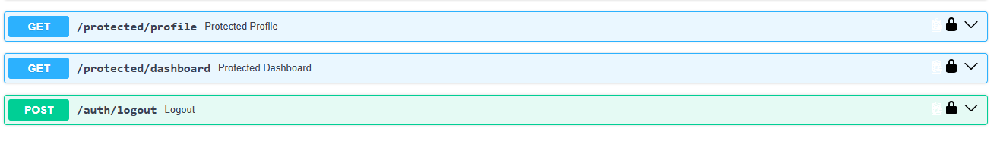
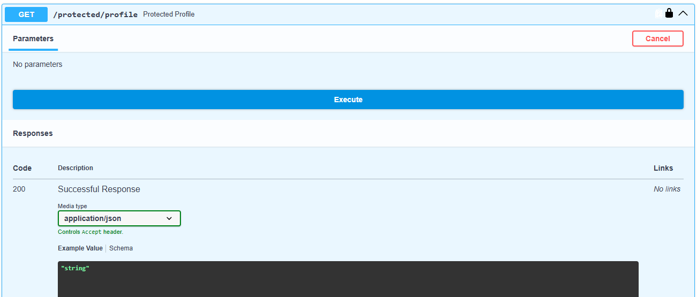
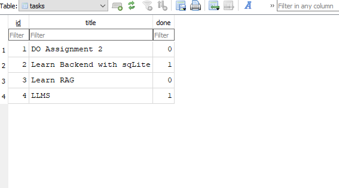
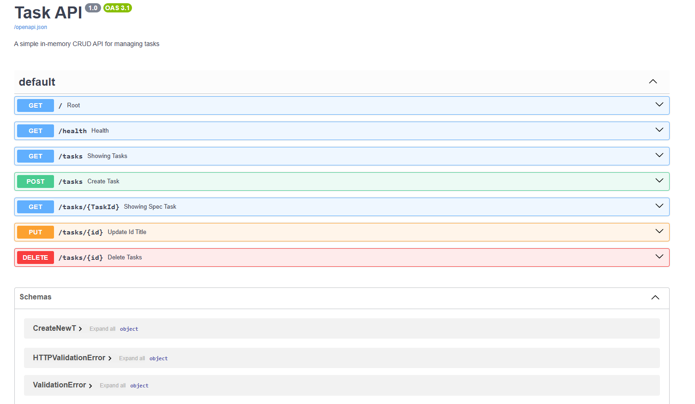
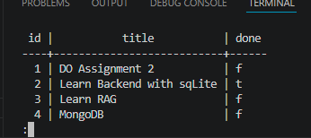

# 📝 Task API (FastAPI + Supabase Auth + PostgreSQL)

A production-grade RESTful API built with **FastAPI**, integrated with **Supabase Authentication** (JWT), **PostgreSQL** persistence, and documented via interactive **Swagger UI (OpenAPI)** with HTTP Bearer security schemes.

Built as part of the FlyRank Internship (Backend AI Track).

---

## 🚀 Key Features

* **Authentication & Authorization:**
  * **User Sign Up & Login:** Secure authentication powered by Supabase Auth (`supabase-py`).
  * **JWT Validation:** Reusable FastAPI dependency (`get_current_user`) acting as an Auth Guard across protected routes.
  * **Session Management:** Dedicated `/auth/logout` endpoint returning `204 No Content`.
* **Interactive API Documentation:**
  * Native **Swagger UI** integration configured with `HTTPBearer` scheme.
  * One-click authorization testing directly from the browser at `/docs`.
* **Task Management (CRUD):**
  * Full task lifecycle management (Create, Read, Update, Delete).
  * Strict request/response validation powered by **Pydantic**.
  * Parameterized SQL queries preventing SQL injection vulnerabilities.
* **Database & Infrastructure:**
  * Persistent **PostgreSQL** storage (`psycopg3`).
  * **Dockerized Execution:** Fully containerized setup via `docker-compose`.

---

## 🛣️ API Endpoints Reference

### 🔐 Authentication Routes
| Method | Endpoint | Description | Auth Required | Status Code |
| :--- | :--- | :--- | :---: | :---: |
| `POST` | `/auth/signup` | Register a new user | ❌ | `201 Created` |
| `POST` | `/auth/login` | Authenticate and obtain JWT token | ❌ | `200 OK` |
| `POST` | `/auth/logout` | Revoke session / Sign out | ✅ | `204 No Content` |

### 🛡️ Protected User Routes
| Method | Endpoint | Description | Auth Required | Status Code |
| :--- | :--- | :--- | :---: | :---: |
| `GET` | `/protected/profile` | Retrieve current authenticated user profile | ✅ | `200 OK` |
| `GET` | `/protected/dashboard` | Protected dashboard test checkpoint | ✅ | `200 OK` |

### 📋 Task Management Routes
| Method | Endpoint | Description | Auth Required | Status Code |
| :--- | :--- | :--- | :---: | :---: |
| `GET` | `/` | API Metadata & Info | ❌ | `200 OK` |
| `GET` | `/health` | Server Health Check | ❌ | `200 OK` |
| `GET` | `/tasks` | List all tasks | ❌ / ✅ | `200 OK` |
| `GET` | `/tasks/{id}` | Get specific task by ID | ❌ / ✅ | `200 OK` / `404` |
| `POST` | `/tasks` | Create a new task | ✅ | `201 Created` |
| `PUT` | `/tasks/{id}` | Update task title or status | ✅ | `200 OK` |
| `DELETE`| `/tasks/{id}` | Delete a task | ✅ | `200 OK` / `204` |

---

## 🛠️ Tech Stack

* **Framework:** FastAPI
* **Auth Service:** Supabase Auth (`supabase-py`)
* **Security Scheme:** `HTTPBearer` (JWT Bearer Token)
* **Database:** PostgreSQL (with `psycopg3`)
* **Data Validation:** Pydantic
* **Containerization:** Docker & Docker Compose

---

## ⚙️ Local Setup & Installation

### Option 1: Running with Docker (Recommended)

1. **Clone the repository:**
   ```bash
   git clone [https://github.com/Michael-09William/fastapi-crud-todo.git](https://github.com/Michael-09William/fastapi-crud-todo.git)
   cd fastapi-crud-todo

  2. **Configure Environment Variables**
     
      Create a (.env) file in the root directory

      ```bash
      cp .env.example .env
      ```
  3. **Launch Database Container**

      Launch Database Container

      ```bash
      docker run --name taskdb -e POSTGRES_PASSWORD=dev -e POSTGRES_DB=tasks -p 5433:5432 -v taskdata:/var/lib/postgresql/data -d postgres:16
      ```
4.  **Run Full Stack via Docker Compose**

      ```bash
      docker compose up --build
      ```


### Option 2: Running Locally (Python Environment)

  1. **Set up Virtual Environment**
      ```bash
      python -m venv env
      # Windows
      .\env\Scripts\activate
      # Linux/macOS
      source env/bin/activate
      
  2. **Install Dependencies**

      ```bash
      pip install -r requirements.txt
      ```
      
  3. **Start Development Server**

      ```bash
      uvicorn main:app --port 8005 --reload
      ```

## 📸 Swagger UI Preview

### Bearer Authorization Setup


### Protected Profile Response (200 OK)


### Database Browser Screenshot


### Swagger Endpoints 


### Database Browser with Postgres and Docker

